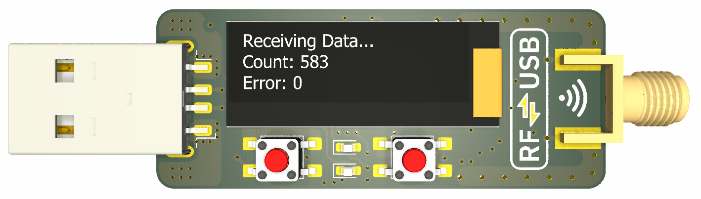

# RF-to-USB

 STM32L4-based RF-to-USB dongle using the NRF24 2.4 GHz transceiver. The board includes a USB-A connector on one side and a female SMA antenna connector on the other. It is a 4-layer PCB created using KiCad 9.0 measuring 50 mm x 20 mm.
 
The schematic (PDF) can be found under [documentation/schematic.pdf](documentation/schematic.pdf)  
The manufacturing Gerber files can be found under [hardware/production](hardware/production)

## Acknowledgements

This project is inspired by [STRF-Kicad](https://github.com/pms67/STRF-Kicad) by Philip Salmony, and has been expanded with a 0.91" OLED display and control buttons for additional functionality and monitoring.
